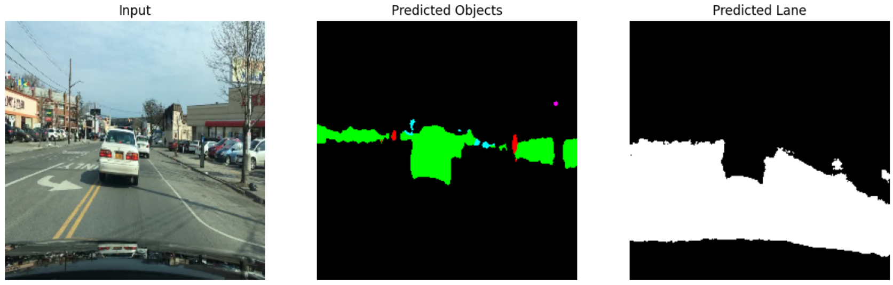
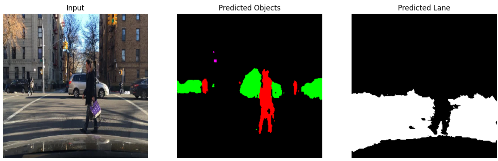
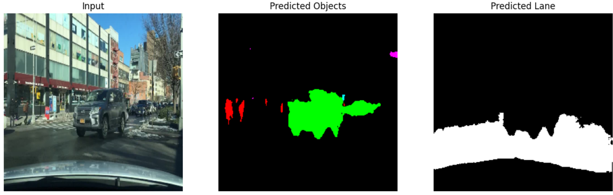

# Lightweight-Perception-Models-for-Autonomous-Driving
Segmentation-based autonomous driving model built as part of the Visual Computing with AI/ML course at IIT KGP.

## Structure:

## Repository Structure

```bash
Segmentation-Autonomous-Driving/
│── Light_weight_model.ipynb      # Training notebook
│── inference.ipynb               # Inference notebook
│── m1.h5                         # Saved trained model
│── test_images.zip               # Sample images for inference
│── bdd100k/                      # Dataset folder (not included in repo)
│── r1.png                        # Sample prediction image
│── r2.png                        # Sample prediction image
│── r3.png                        # Sample prediction image
└── README.md
```
## Dataset:

This project uses the BDD100K dataset (Berkeley DeepDrive 100K) for semantic segmentation.  
The dataset used was obtained from Kaggle’s packaging of BDD100K (solesensei/solesensei_bdd100k).
Due to licensing and size constraints, the dataset is **not included** in this repository.  

Please download it directly from Kaggle: 
[https://www.kaggle.com/datasets/solesensei/solesensei_bdd100k](https://www.kaggle.com/datasets/solesensei/solesensei_bdd100k?select=bdd100k_seg) 

Follow the official license and terms of use provided by the dataset source.

## Codes:

Lightweight_Model.ipynb: contains the complete training and validation pipeline.
inference.ipynb:         contains code to load saved model and perform inference on test images.

## Model File:

The trained model is saved as m1.h5 and can be directly used for inference.

## Test Images:

A small set of sample images is provided in test_images.zip for running inference.

## How to Run:

1. Download the Dataset from Kaggle and place it appropriately in the project folder. (preferably Google drive if using Colab).
2. Run Lightweight_Model.ipynb to train the model and save model file as m1.h5.
3. Load the test images and m1.h5 file, and run inference.ipynb for results.

## Results





